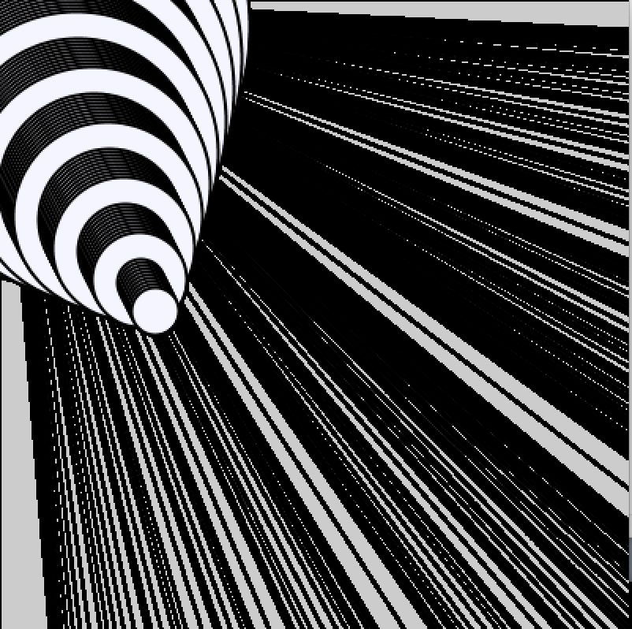
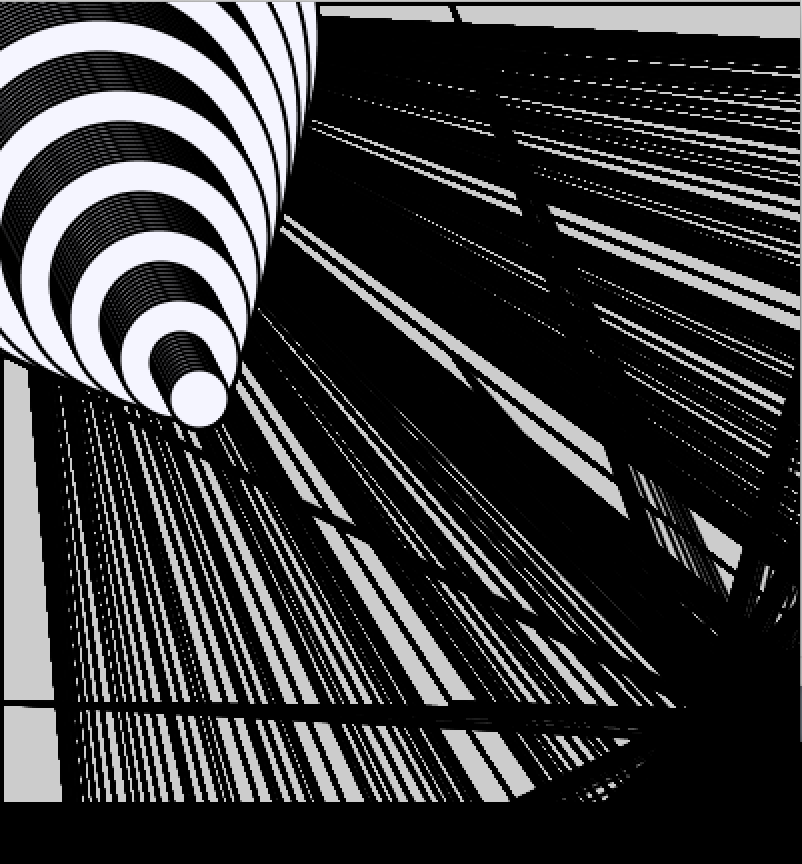

# September22 Assignment
## Interactive “old computer graphics” Inspired Artwork

For this week’s production assignment, the most difficult part was coming up with a cool idea that was abstract and interactive. I started off with a simple idea and continued adding to the project from there keeping user experience and interactions in mind. I wanted it to resemble old computer artwork that is seen in graphic magazines yet still make it interactive instead of static. 
This artwork allows the user to interact with it by hovering over the popup window and coloring it in with the line strokes until only the first pattern shows. 
  
  

  

  
  **This is the static interpretation of the artwork.**  
  When you first run it:  
  
    
  
  Upon hovering over the window with the mouse:  
  
    

  The final product (after completely hovering over the window and filling it up):  
  
    

  

  
<a href = "https://github.com/LiyanIbrahim/intro-to-IM/blob/master/September22/Art_2.pde" target = "_self">Click here to run the code and interact with the    artwork!</a>
   
  

